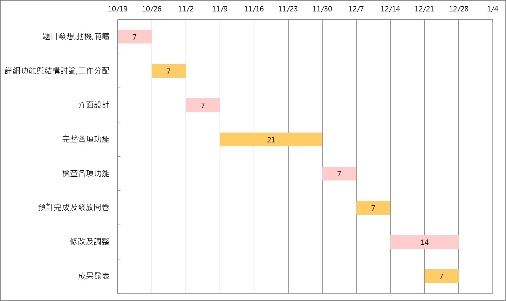
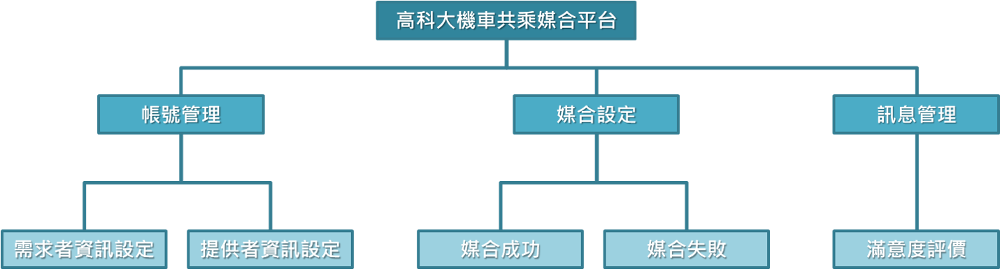
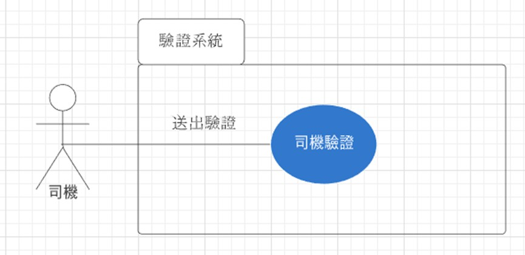
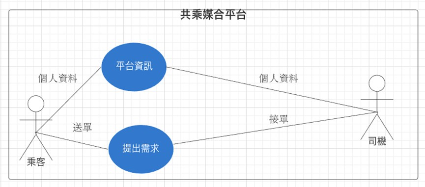
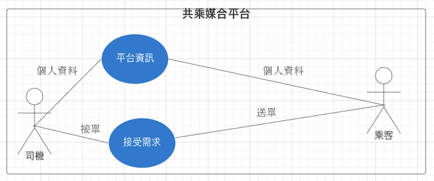
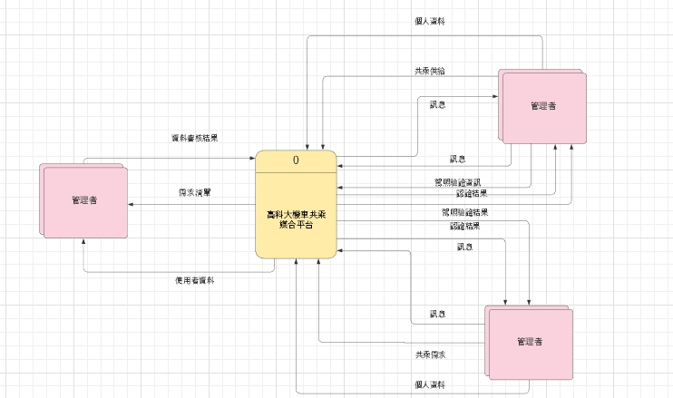
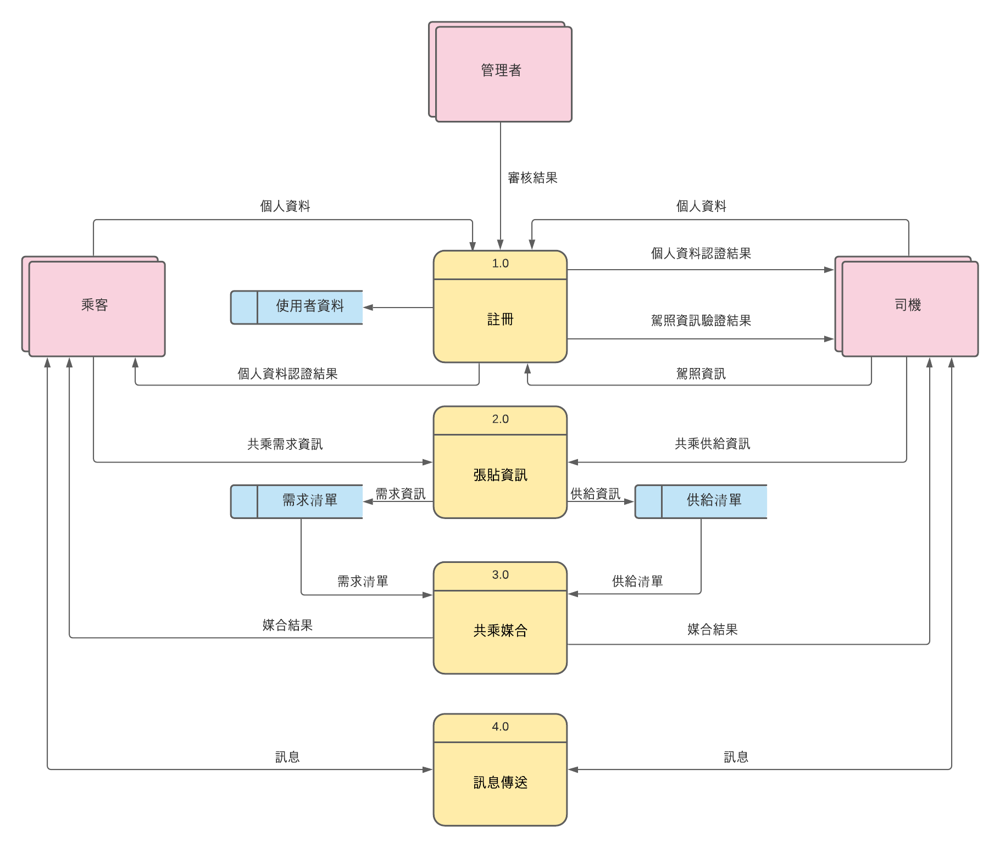

# OO_第九組
## 題目：高科大機車共乘媒合平台 
## 成員：
 * C107118209 黃湘雲
 * `C107118219 蔡佳蓁-組長`
 * C107118226 鄭棓云
 * C107118231 溫玉婕 
### 摘要：
> 我們想要有一個平台能夠尋找司機，在順路的路途接受共乘的請求，增加一點小費。可以改善在學校沒有機車的不方便，以及公車班次不足等問題。媒合司機和乘客，讓雙方能夠互利的情況下促進資源有效利用。
> 平台將設置一個欄位，司機方和乘客方可以填寫「想要的報酬」和「可提供的報酬」，並讓司機能夠去尋找乘客、乘客也可以去尋找司機，加速服務機會。
***
### 工作分配：
| 成員 | 內容 |
| :---------: |:----------------- |
| 蔡佳蓁 | 帶領組員 |
| 黃湘雲 | 介面設計 |
| 鄭棓云 | 程式撰寫 |
| 溫玉婕 | 結構設計 |
***
### 甘特圖

***
### PERT/CPM圖

***
### 功能性需求
* 尋找共乘座位：給未擁有機車的人張貼共乘需求
* 提供共乘座位：想要分享座位的人張貼共乘供給
* 私密訊息：媒合成功後雙方自行談妥詳細資訊
* 系統管理：管理者管理帳號及審核註冊者資訊、駕照期限
### 非功能性需求
* 穩定的系統
* 系統可即時反應供需
* 易上手的操作介面
***
### FDD

### 需求分析簡述如下
1. 使用者透過平台註冊帳號。
2. 管理者透過後台管理使用者資料。
3. 司機在認證系統驗證駕照。
4. 使用者可以在平台張貼共乘需求或邀請。
5. 使用者可以透過平台尋找共乘需求或邀請。
6. 媒合成功後，可透過私密聊天室聯繫詳細資訊。
7. 共乘過後，雙方能透過評價系統給予評價。
8. 使用者可檢視其他使用者的評價。
9. 使用者可透過檢舉系統檢舉其他使用者之不法行為。

### 使用案例圖

#### `說明`
| 使用案例名稱 | 司機驗證 |
| :---------: |:----------------- |
| 行動者 | 司機 |
| 說明 | 描述司機認證過程 |
| 完成動作 | 1.司機點撃輸入選項並輸入車牌及駕照等資訊 2.系統驗證司機身分 3.系統寄送認證訊息 |
| 代替方法 | 1.司機點擊輸入選項並輸入車牌及駕照等資訊 2.系統驗證司機身分 3.系統寄送拒絕訊息 |
| 先決條件 | 司機須成年且有駕照 |
| 後置條件 | 司機驗證結束,司機可以開始接單 |
| 假設 | 無 |
***

#### `說明`
| 使用案例名稱 | 乘客尋找司機 |
| :---------: |:----------------- |
| 行動者 | 乘客 |
| 說明 | 描述司機認證過程 |
| 完成動作 | 1.登陸平台後,按下申請需求按鈕並填寫姓名或暱稱及需求時間、距離、報酬等 2.司機接單後,去平台詳閱媒合司機的車牌、車型、相約時間及地點等 3.相認 |
| 代替方法 | 1. 登陸平台後,按下申請需求按鈕並填寫姓名或暱稱及需求時間、距離、報酬等 2. 司機接單後,去平台詳閲媒合司機的車牌、車型、相約時間及地點等 3.請求系統協助相認 |
| 先決條件 | 客及司機皆可接受雙方要求及報酬 |
| 後置條件 | 乘客滿足需求,可繼續再提出需求 |
| 假設 | 確定有司機接單且不棄單 |
***

#### `說明`
| 使用案例名稱 | 司機尋找乘客 |
| :---------: |:----------------- |
| 行動者 | 司機 |
| 說明 | 描述司機尋找乘客過程 |
| 完成動作 | 1.登陸平台後,按下接受需求按鈕 2.接單後,去平台詳閱媒合乘客的姓名或暱稱及需求時間、距離、報酬等 3.相認 |
| 代替方法 | 1. 登陸平台後,按下接受需求按鈕 2. 接單後,去平台詳閱媒合乘客的姓名或暱稱及需求時間、距離、報酬等 3. 請求系統協助相認 |
| 先決條件 | 司機及乘客皆可接受雙方要求及報酬。 |
| 後置條件 | 司機完成需求,可繼續再接單 |
| 假設 | 確定司機接單且不棄單 |
### 系統環境圖 (DFD)

### DFD 圖0

